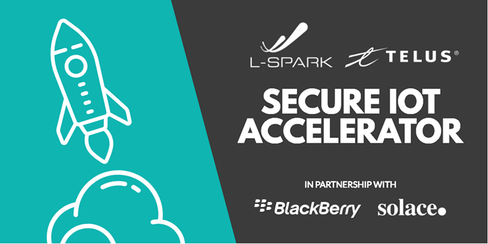
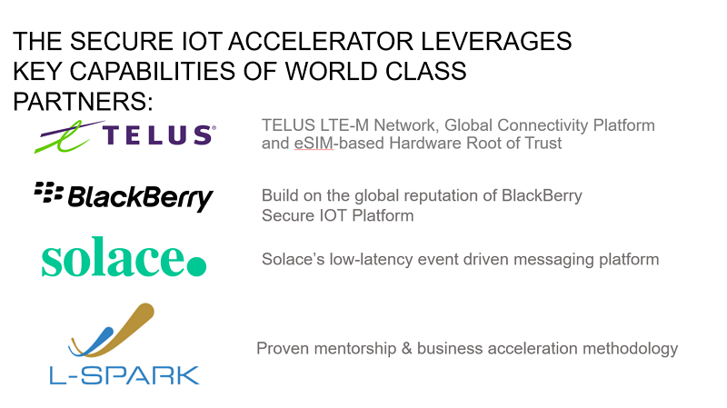

# Secure IoT Accelerator Program

The Secure IoT Accelerator program is intended to enable Canadian Internet of Things (IoT) ventures by providing them with global market reach capability with a Secure by Design technology.

For more information about the accelerator program, visit: https://www.l-spark.com/press-release/l-spark-telus-blackberry-and-solace-launch-accelerator-for-emerging-canadian-iot-ventures/

Youtube: https://www.youtube.com/watch?v=ZL2ADLHl-XQ&feature=youtu.be

IoT technical information session webinar: https://zoom.us/recording/share/PWJ3D-qfgsRB5TrQGfzrThJIY4mG5bUspvZ49OwiZNywIumekTziMw

# Resources

## TELUS
* [Getting Started with TELUS Developer Kit](https://github.com/TELUS-Emerging-IoT/TELUS-Devkit-Hardware-Tutorial) - To help accelerator program participants with setting up the cellular shield, raspberry pi and installing applications required to validate devkit functions and features.

* [Running the Scc demo application](https://github.com/TELUS-Emerging-IoT/Scc-DemoApplication) - This guide shows you how to compile and run the scc demo application, illustrating sim access and security app. 

#### BG96 Module Firmware Upgrade
* [TELUS Shield BG96 Firmware Update](https://github.com/TELUS-Emerging-IoT/TELUS-IoT-BG96-Firmware-Update) - This is optional, if needed, the github link will show participants how to upgrade the BG96 module firmware.

## Solace
* [Solace Demo Application](https://github.com/solace-iot-team/solace-iot-device-sdk-embedded-C) - The Solace MQTT IoT SDK provides secure MQTT connectivity on the IoT Accelerator Device Platform. It includes an example on how to utilise the Telus SIM Secure Storage element to establish a TLS connection to Solace Cloud.

#### Tools & Utilities
* Demo application on linux instructions: https://github.com/solace-iot-team/solace-iot-device-sdk-embedded-C/blob/master/scc_demo_app.md

* A command line tool to upload device credentials to the SIM Card via the SCC API: https://github.com/solace-iot-team/solace-iot-device-cert-upload/blob/master/README.md
